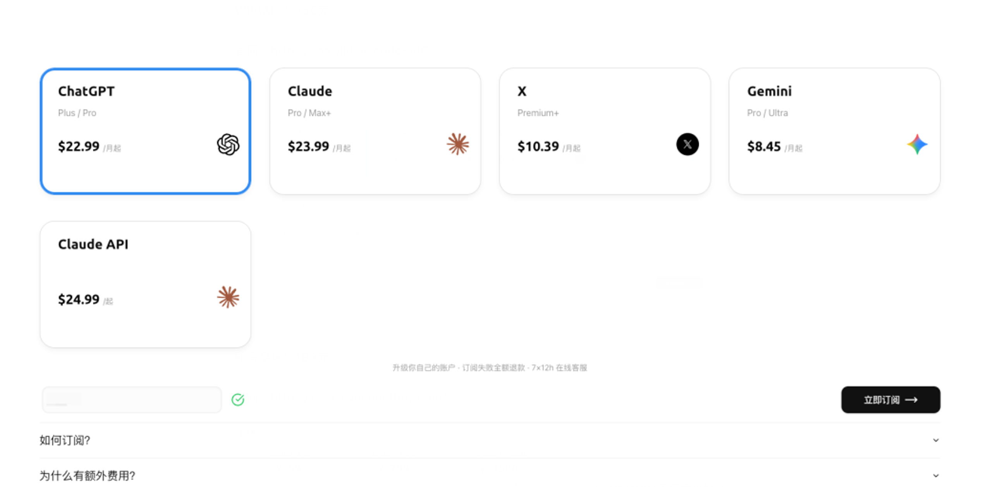
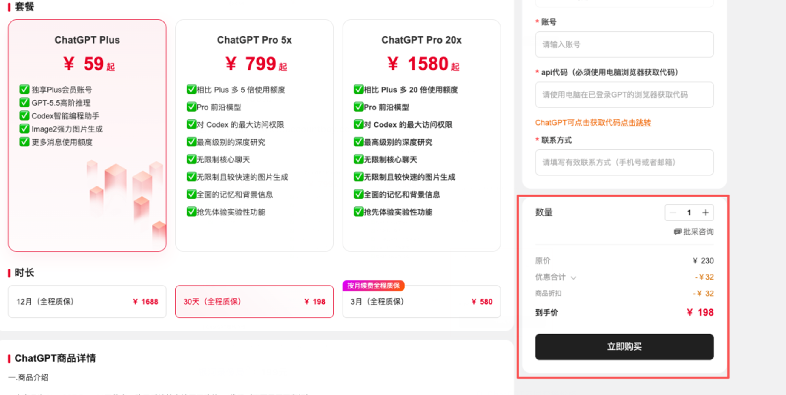
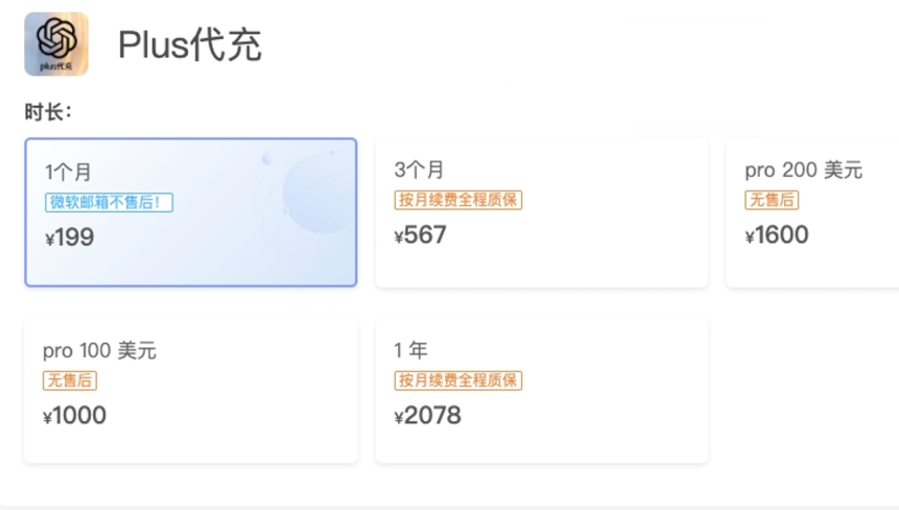
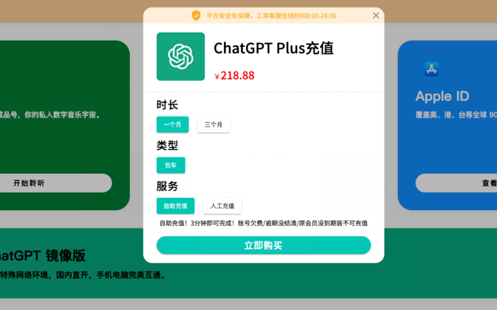
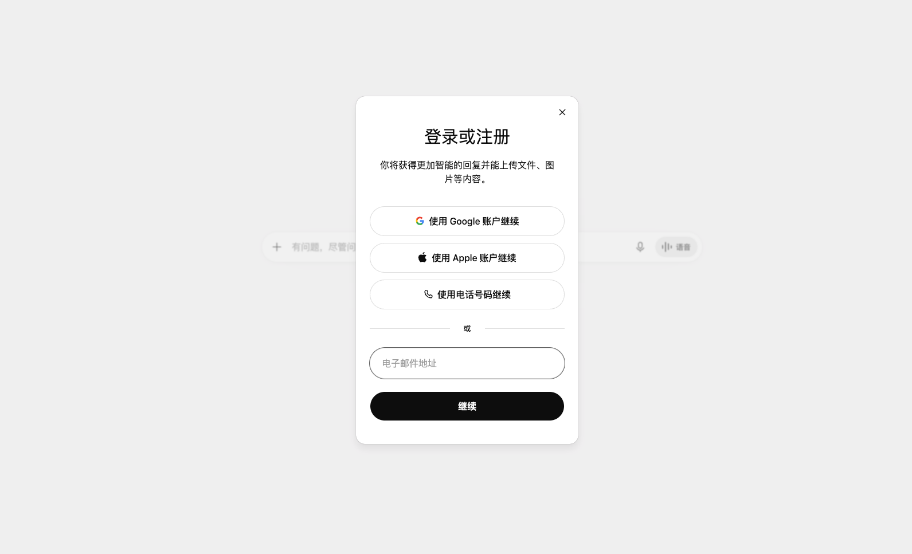
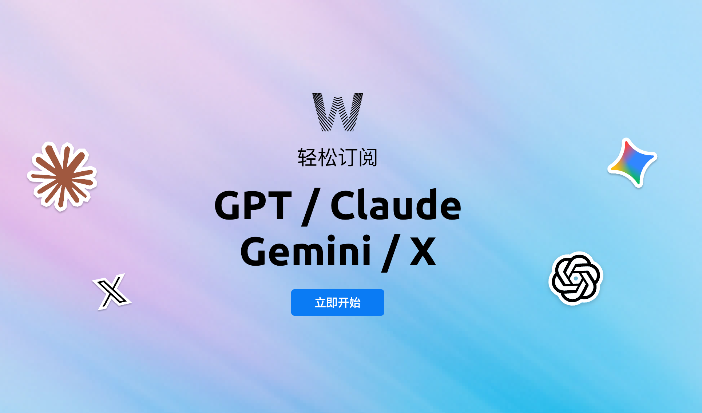
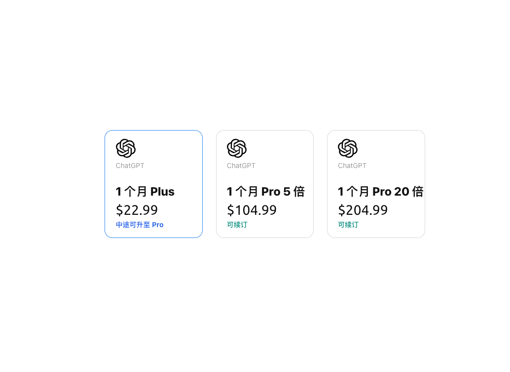
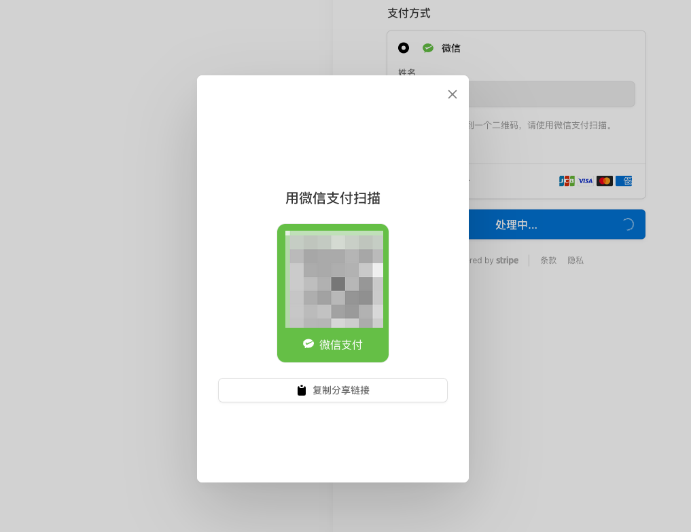
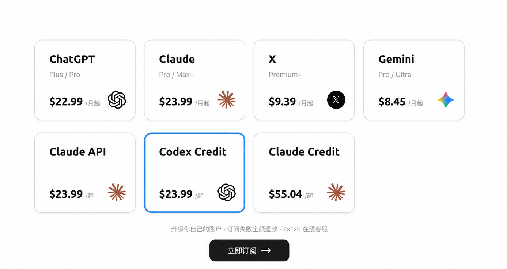

# 2026 最新 ChatGPT / GPT 订阅充值教程：国内开通 ChatGPT Plus / Pro 完整指南

> 📅 最新更新时间：2026年7月14日（每周更新，建议 Star ⭐ 收藏防走丢）
>
> 本教程覆盖：**ChatGPT 订阅**、**ChatGPT 充值**、**GPT 订阅**、**GPT 充值**、**GPT Credit 充值（Codex Credit）**、**GPT 长期订阅** 六大主题，微信付款全流程图解，附常见报错排查。

---

## 📋 目录

- [一、GPT 订阅方式总览：四种方案对比](#一gpt-订阅方式总览四种方案对比)
- [二、ChatGPT 充值教程：微信开通 ChatGPT Plus](#二chatgpt-充值教程微信开通-chatgpt-plus)
- [三、Codex Credit 充值教程](#三codex-credit-充值教程)
- [四、GPT 长期订阅方案：月付 vs 年付 vs Team](#四gpt-长期订阅方案月付-vs-年付-vs-team)
- [五、价格总表（2026年7月）](#五价格总表2026年7月)
- [六、常见问题 FAQ](#六常见问题-faq)
- [七、常见报错排查（10 个高频问题）](#七常见报错排查10-个高频问题)

---

## 一、GPT 订阅方式总览：四种方案对比

在国内订阅 ChatGPT Plus / Pro，目前主流有四种方式，各有优劣：

| 方式 | 门槛 | 成本 | 风险 | 适合人群 |
|---|---|---|---|---|
| ① 海外信用卡直接订阅 | 需要 Visa/Mastercard 海外卡 | $20/月，无额外费用 | 低 | 有海外卡的用户 |
| ② 虚拟信用卡（自己开卡） | 需要开卡平台账号，充值有手续费 | $20/月 + 开卡费/手续费 | 中（部分卡段被 OpenAI 风控拒付） | 动手能力强、愿意折腾的用户 |
| ③ App Store 礼品卡（iOS 内购） | 需要美区 Apple ID | 比官网贵约 10%（苹果抽成） | 低 | iPhone 用户 |
| ④ 订阅协助服务（微信直付） | 无门槛 | 官方价 + 少量服务费 | 低（选有退款保障的平台） | 想省事、不想折腾卡的用户 |

**结论**：

- 有海外信用卡 → 直接走方式 ①，最省钱
- 没有海外卡、不想折腾 → 方式 ④ 最简单。目前用得比较多的是 [WildAI](https://bewild.ai?code=AIG)，支持微信直接付款，订阅失败全额退款，注册时用邀请码 `AIG` 有优惠

### 四家主流第三方平台横向对比（2026年7月实测）

如果决定走方式 ④，市面上平台不少，我找了 4 家 ChatGPT 订阅相关的平台逐一对比了 Plus 的价格。最低 156 元，最贵高达 218.88 元，从低到高排序：

**WildAI：156 元**
官网：[bewild.ai](https://bewild.ai?code=AIG)

**账号星球：198 元**
官网：accountboy.com

**银河录像局：199 元**
官网：nf.video

**环球巴士：218.88 元**
官网：universalbus.cn

除了价格，还有一个覆盖面的差异：四家平台都支持 ChatGPT Plus，Pro 订阅则只有 WildAI 和银河录像局两家提供；而 **Codex Credit、Claude Max 和 Claude API 充值，四家中只有 WildAI 支持**——如果你是开发者，除了聊天订阅还要充编程额度，基本只有它一家能一站搞定。

两点说明：

- 官方直订（$20/月）在账号归属、服务条款和申诉路径上最清晰，有海外卡的话永远是第一选择。第三方的价值在于用少量差价换掉开卡的折腾和拒付风险
- 以上价格为 2026 年 7 月实测，各平台会调价，下单前以官网实时价格为准

---

## 二、ChatGPT 充值教程：微信开通 ChatGPT Plus

以最简单的方式 ④ 为例，全程约 5 分钟：

### 步骤 1：注册 ChatGPT 账号

1. 打开 https://chatgpt.com ，用邮箱或 Google 账号注册

2. 如果提示地区不可用，说明当前网络环境不支持，需要切换网络节点后再试
3. 注册完成后先登录确认账号正常

### 步骤 2：选择订阅服务

1. 打开 [bewild.ai](https://bewild.ai?code=AIG)（注册时填邀请码 `AIG` 会优惠一美金）

2. 进入订阅页，根据自己的需求选择 ChatGPT Plus 或 Pro 套餐

3. 按照流程使用微信完成付款

### 步骤 3：确认开通

1. 付款后等待开通通知（一般几分钟即可）
2. 登录 ChatGPT，左下角头像 → Settings → Subscription 显示 **Plus** 即成功
3. 如果长时间未开通，联系平台客服；订阅失败会全额退款

---

## 三、Codex Credit 充值教程

很多人搜「gpt credit 充值」，如果你是在用 **Codex**（OpenAI 的编程智能体，CLI / IDE 插件）写代码，要充的就是 **Codex Credit**——它和 ChatGPT Plus 订阅是两回事，先分清区别：

| | ChatGPT Plus 订阅 | Codex Credit |
|---|---|---|
| 用途 | 网页版/App 聊天 | Codex 编程用量额度 |
| 计费 | 固定月费 | 按用量扣，预充值 |
| 什么时候需要 | 想用最新模型聊天 | Plus/Pro 自带的 Codex 用量触顶后 |

### 为什么需要单独充 Codex Credit

1. Plus / Pro 订阅自带一定的 Codex 用量，日常轻度使用够用
2. 重度写代码（大项目、高频调用）很容易触顶，触顶后要么等额度刷新，要么购买额外 Credit 按量使用
3. 官方购买入口需要海外信用卡；国内用户可以直接在第三方平台充——四家对比平台中只有 WildAI 上线了这个入口

### Codex Credit 充值步骤（微信支付，$23.99 起）

1. 打开 [bewild.ai](https://bewild.ai?code=AIG)，注册时填邀请码 `AIG`
2. 进入「订阅」页，选择 **Codex Credit** 卡片（注意：需要先在 WildAI 订阅 ChatGPT 会员，才能使用 Codex Credit 订阅功能，Claude Credit 同理）

3. 按提示用微信完成付款
4. 几分钟到账，充的是**你自己账号**的额度；订阅失败全额退款，有 7×12h 在线客服

同页还有 **Claude Credit / Claude API** 充值入口，用 Claude Code 的开发者可以顺手一起解决，流程相同。

> ⚠️ 提醒：警惕超低价 Credit——远低于官方价的额度大概率来自盗刷卡，账号随时可能被封禁。选按官方价透明计费、有退款保障的平台。

---

## 四、GPT 长期订阅方案：月付 vs 年付 vs Team

如果你确定长期使用，选对方案一年能省不少钱：

### 方案对比

| 方案 | 价格 | 折算月价 | 适合 |
|---|---|---|---|
| Plus 月付 | $20/月 | $20 | 短期试用 |
| Plus 年付* | 见官网 | 通常有折扣 | 确定长期用的个人 |
| Team 版（按席位） | 约 $25–30/席位/月 | — | 2 人以上团队，含更高用量和管理后台 |
| Pro | $200/月 | $200 | 重度用户，需要更高用量档 |

*年付入口和折扣以 OpenAI 官网当期政策为准。

### 长期订阅防断订指南

长期订阅最烦的是**扣款失败导致断订**，常见原因和对策：

1. **虚拟卡余额不足** → 设置日历提醒，每月扣款日前 3 天检查余额
2. **卡片被风控冻结** → 准备一张备用卡；断订后 72 小时内补款一般可以无缝恢复
3. **不想每月操心** → 用订阅协助服务的长期套餐一次搞定，比如 [WildAI](https://bewild.ai?code=AIG) 支持按季/按年代管订阅，到期前会提醒续费（邀请码 `AIG`）

### 多人拼车的风险提示

网上流行的「Plus 拼车」（多人共用一个账号）价格便宜，但要清楚风险：多设备频繁切换 IP 容易触发风控封号、聊天记录互相可见没有隐私、车主跑路无处维权。预算允许的话建议独享账号。

---

## 五、价格总表（2026年7月）

| 项目 | 官方价格 | 说明 |
|---|---|---|
| ChatGPT Plus | $20/月 | 个人版，最新模型 + 更高用量 |
| ChatGPT Pro | $200/月 | 重度用户，最高用量档 |
| ChatGPT Team | 约 $25–30/席位/月 | 团队版，最少 2 席位 |
| Codex Credit | $23.99 起 | 按用量扣费，Plus/Pro 用量触顶后加购 |

> 汇率参考：$20 ≈ ¥145 左右（以实际汇率为准）。低于官方价太多的渠道请务必警惕。

---

## 六、常见问题 FAQ

**Q1：GPT 订阅和 GPT 充值是一回事吗？**
日常说的「充值」大多指订阅 Plus 会员；如果你是用 Codex 写代码要加额度，则是充 Codex Credit，两者入口和计费完全不同，见第三章。

**Q2：没有海外信用卡能订阅吗？**
可以。要么自己开虚拟卡（有折腾成本和拒付风险），要么用微信直付的订阅协助服务，5 分钟搞定。

**Q3：第三方订阅安全吗？会不会封号？**
选正规平台风险很低，看三点：是否明码标价、订阅失败是否全额退款、是否需要你提供账号密码以外的敏感信息。用自己的账号被代订阅，本身不违反 OpenAI 对个人用户的常规使用。

**Q4：付款后多久生效？**
官网直接订阅是即时生效；第三方平台一般几分钟到几十分钟。

**Q5：Plus 到期后会自动扣款吗？**
官网绑卡订阅默认自动续费，可在 Subscription 页面随时取消；协助服务代订的看平台政策，一般到期不自动扣。

**Q6：可以中途取消退款吗？**
OpenAI 官方一般不支持按比例退款，取消后当期会员可用到期末。

**Q7：Plus 和 Pro 怎么选？**
日常使用选 Plus 足够；只有当你频繁触顶用量限制、需要最高档模型算力时才考虑 Pro。

**Q8：学生有优惠吗？**
OpenAI 目前没有长期稳定的学生折扣政策，偶有限时活动，以官网公告为准。

**Q9：一个账号能几个人用？**
官方条款是个人账号仅限本人使用，多人共用有封号风险，多人场景建议上 Team 版。

**Q10：Codex Credit 会过期吗？**
充值的 credit 有有效期（以账户内显示为准），建议按实际用量分次充值，不要一次囤太多。

---

## 七、常见报错排查（10 个高频问题）

| # | 报错/现象 | 原因 | 解决办法 |
|---|---|---|---|
| 1 | Your card has been declined | 卡段被风控 / 余额不足 | 换卡段；确认余额 > $25；间隔 24h 再试 |
| 2 | We are unable to authenticate your payment method | 账单地址与 IP 不匹配 | 账单地址改为与网络环境一致的地区 |
| 3 | Something went wrong（订阅页白屏） | 网络环境不干净 | 更换网络节点，用无痕窗口重试 |
| 4 | You've reached our limit of messages | 触顶用量限制 | 等待额度刷新；重度使用考虑升级 |
| 5 | Unable to load site / 拒绝访问 | 当前地区不支持 | 切换网络环境后刷新 |
| 6 | 订阅成功但没显示 Plus | 生效延迟 / 缓存 | 退出重新登录；清缓存；超 1 小时联系平台客服 |
| 7 | Codex 提示额度不足 / usage limit reached | Plus/Pro 自带用量触顶 | 等额度周期刷新，或充 Codex Credit（见第三章） |
| 8 | Codex Credit 充值后额度没变 | 到账延迟 / 未登录同一账号 | 确认充的是当前登录账号；超时联系平台客服 |
| 9 | 续费扣款失败被降级 | 卡余额不足/卡失效 | 72h 内更新支付方式补款可恢复 |
| 10 | 绑卡时页面一直转圈 | 浏览器插件拦截 | 关闭广告拦截插件，换浏览器重试 |

---

## 🔗 相关链接

- ChatGPT 官网：https://chatgpt.com
- 微信直付订阅 ChatGPT Plus / Pro / Codex Credit / Claude（本教程推荐）：[bewild.ai](https://bewild.ai?code=AIG) · 邀请码 `AIG`，订阅失败全额退款

---

> ⭐ 如果本教程帮到了你，点个 Star 支持一下，教程每周更新最新可用方案。
> 有问题欢迎提 [Issue](../../issues)，看到都会回复。
>
> 免责声明：本仓库仅作信息分享，价格与政策以 OpenAI 官网实时信息为准，请遵守所在地区法律法规及各平台服务条款。